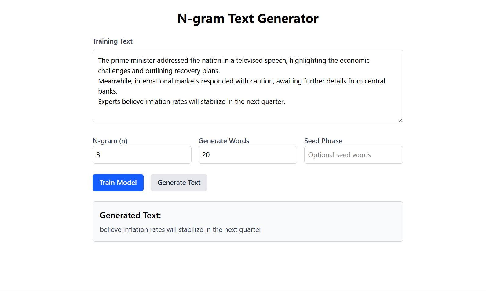

# 🧠 N-gram Language Model Text Generator

This is a simple NLP project that implements an **N-gram language model** using a Python Flask backend and a beautiful React + Vite + Tailwind frontend. It allows users to:

- Train an N-gram language model on custom input text
- Generate text of specified length
- Select between 1-gram, 2-gram, and 3-gram models

---

## 📁 Folder Structure

```
project-root/
├── backend/
│   └── app.py               # Flask server with N-gram logic
├── frontend/
│   └── [Vite React App]     # React + TypeScript + Tailwind
├── screenshot/
│   └── frontend.png         # Screenshot of the UI
└── README.md
```

---

## 🤖 What is an N-gram Language Model?

An **N-gram language model** is a probabilistic language model used for predicting the next item in a sequence. It uses the previous N-1 words to predict the next one.

- **Unigram (1-gram):** Predicts each word independently.
- **Bigram (2-gram):** Uses the previous word to predict the next.
- **Trigram (3-gram):** Uses the two previous words for prediction.

### Formula:

For an n-gram sequence \(w*1, w_2, \ldots, w_n\):
\(P(w_n | w_1, w_2, \ldots, w*{n-1}) \approx P(w*n | w*{n-(n-1)}, \ldots, w\_{n-1})\)

The model is trained by counting frequency of n-grams in the training corpus and using these counts to compute probabilities.

---

## 🔧 Features

- Train model with any custom text
- Set n-gram value (1 to 3)
- Enter optional seed text for generation
- Choose number of words to generate
- Clean, responsive UI with Tailwind

---

## 🚀 Setup Instructions

### 🔙 Backend (Flask)

```bash
cd backend
pip install -r requirements.txt
python app.py
```

### 🌐 Frontend (React + Vite)

```bash
cd frontend
npm install
npm run dev
```

---

## 📸 Screenshot

## 

## 📫 Contact

For questions or improvements, feel free to raise an issue or contact the maintainer.

---

## ✅ Future Improvements

- Add support for saving/loading models
- Display n-gram probability distribution
- Add smoothing methods (e.g., Laplace)
